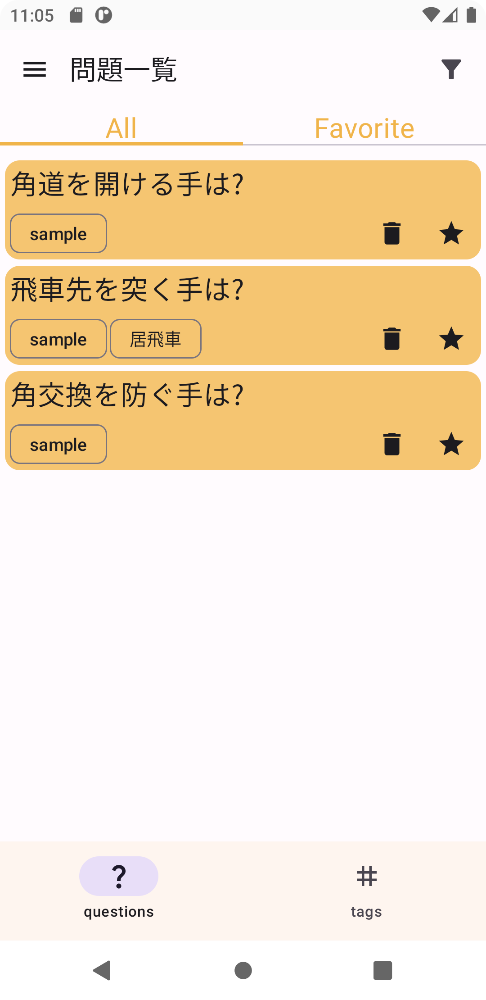
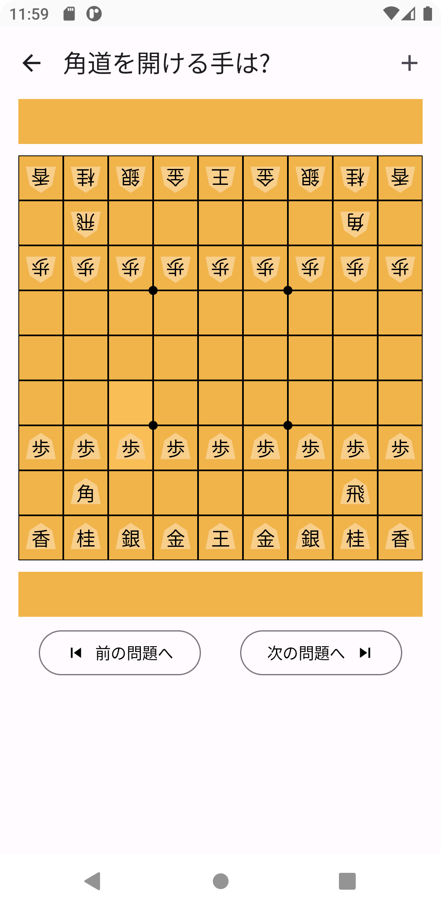
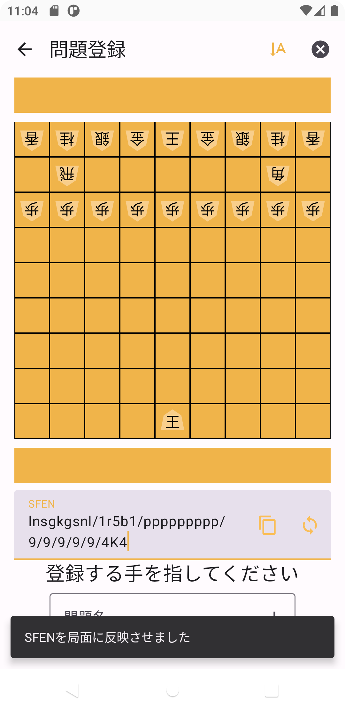
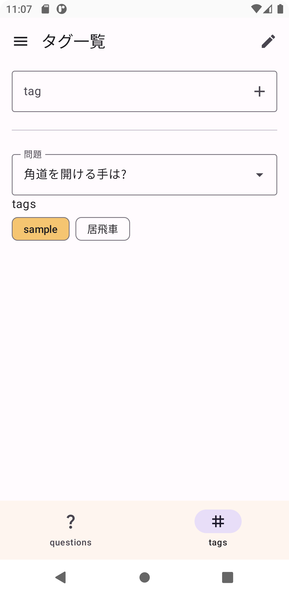

# kiando

Android application to solve/register next-move questions in shogi.

You can download it in [GooglePlay](https://play.google.com/store/apps/details?id=jp.kawagh.kiando)

<p>


</p>
<p>


</p>


## feature

- register questions by user
- edit board ignoring turn
- encode/decode SFEN
- add tag and filter questions

## run tests

```sh
./gradlew test
./gradlew connectedAndroidTest # `/gradlew cAT`
```
