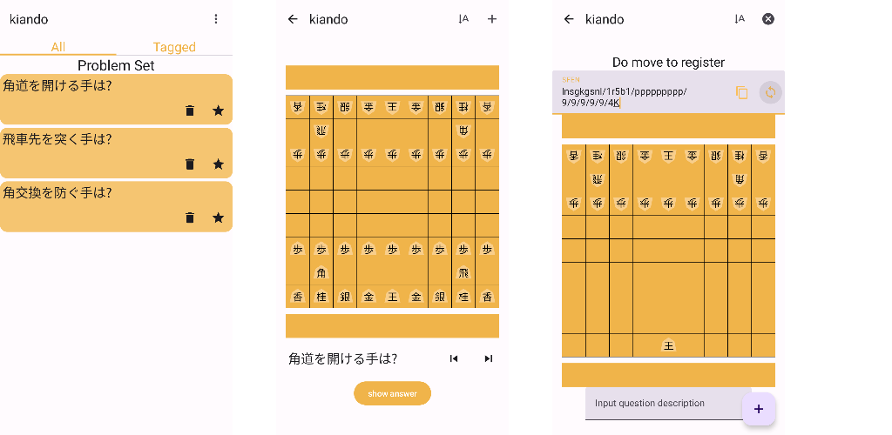

# kiando

Android application to solve/register next-move questions in shogi.

You can download it in [GooglePlay](https://play.google.com/store/apps/details?id=jp.kawagh.kiando)



## feature

- register questions by user
- edit board ignoring turn
- encode/decode SFEN
- favorite tagging

## library

- JetpackCompose
- NavigationCompose
- Room

## run tests

```sh

./gradlew test
./gradlew connectedAndroidTest # `/gradlew cAT`
```